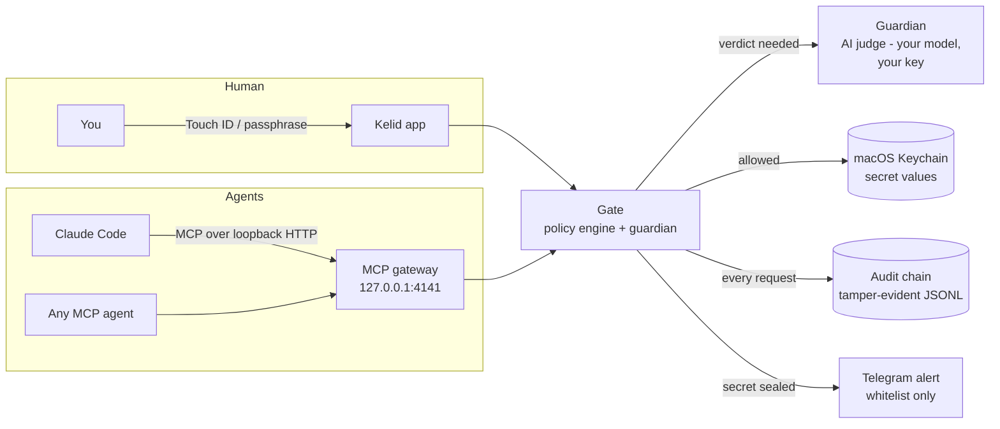
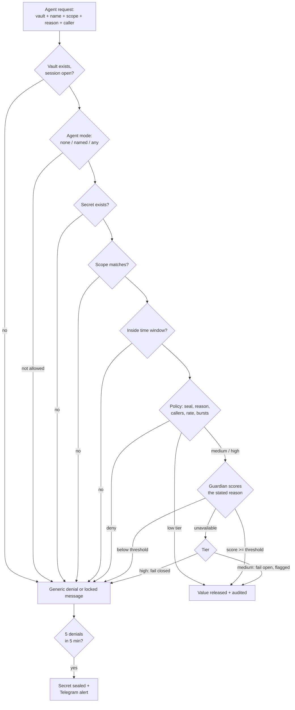

# Kelid

**The key your AI agents have to ask for.**

Kelid (کلید, Persian for "key") is a native macOS secret access layer for cooperative AI
agents — the Swift successor of [Svault](https://github.com/nim444/Svault). An agent must say
*which* vault, *which* secret, in *what* scope, and *why*; a policy engine and an AI guardian
decide; everything lands in a tamper-evident audit chain. Humans unlock with Touch ID, agents
connect over MCP — two doors, one gate.

> **The boundary, stated up front.** Kelid is for cooperative and semi-trusted agents. It is
> not a sandbox against a hostile process running as your own user — that boundary is
> inherited from Svault's threat model and stated honestly everywhere.

## How it works



Every `kelid_get_secret` call runs the same enforced pipeline — there is no second path to a
value:



Key properties:

- **Generic denials.** A denied agent learns nothing — not whether the secret exists, not
  which check failed, not the lock configuration. The real reason goes only to your audit log.
- **Per-secret protection.** Rate limits, bursts, and brute-force sealing are properties of
  each secret (counted across all callers), not the vault — a runaway agent hits the ceiling
  on one secret without locking the rest.
- **Agents never unlock.** The MCP gateway is loopback-only, off by default, and serves only
  after a human's unlock — bounded per vault by its own auto-lock timer. The GUI lock and the
  agent session are deliberately separate.

## What works today

Built step by step; every step is logged in [docs/MILESTONES.md](docs/MILESTONES.md).

- **Onboarding** — Splash, Terms, passphrase (PBKDF2-HMAC-SHA256, 600k rounds, 32-byte salt),
  one-time recovery code, Touch ID, YubiKey. Liquid Glass / macOS 27 styling.
- **Vaults and secrets** — Svault's 4-step vault wizard (agent access, default tier, guardian,
  locking) and 2-step secret wizard (scope, tier, callers, time windows, rate limit). Secret
  values live in the macOS Keychain — never in plaintext on disk.
- **Guardian** — an AI judge you configure with your own provider and model (OpenRouter,
  OpenAI, Anthropic, AWS Bedrock, LM Studio, Ollama). Scores each request's stated reason
  against the secret's documented purpose; thresholds per tier; test console included.
- **MCP agent gateway** — Streamable HTTP on loopback, `kelid_list_vaults` +
  `kelid_get_secret`. Connect Claude Code with one command (shown in the app).
- **Audit** — every action lands in a hash-chained JSONL log; the chain head is anchored in
  the Keychain so even tail-truncation is detected. Daily-activity charts, filters, search.
- **Telegram alerts** — default-deny whitelist; a sealed secret pings you immediately.
- **Auto-lock** — idle GUI lock with Touch ID or passphrase unlock (click-initiated, never
  auto-prompting); per-vault agent-serving windows (30m / 12h / 1d after your last unlock).
- **YubiKey** — dependency-free native CTAP2/FIDO2 over USB HID: `getInfo`, clientPIN v1
  (ECDH P-256), `makeCredential` with the `hmac-secret` extension.

### Honest interim-crypto note

The crypto core (Argon2id keyslots, per-vault AES-256-GCM stores, Touch ID/YubiKey keyslot
binding) is the next major milestone. Until then: the master passphrase exists only as a
PBKDF2 verifier, secret values are stored exclusively in the macOS Keychain
(OS-encrypted, this-device-only), and locking is policy-enforced rather than cryptographic.
No secret, passphrase, or recovery code is ever written to disk in plaintext — but a locked
Kelid today refuses requests; it does not yet drop keys from memory.

## Install

Requires **macOS 27 on Apple silicon**.

Download the DMG from [Releases](https://github.com/nim444/kelid/releases). The app is
ad-hoc signed (not notarized): right-click the app, choose **Open**, and confirm once.

Or build from source:

```sh
git clone https://github.com/nim444/kelid && cd kelid
xcodebuild -project Kelid.xcodeproj -scheme Kelid -configuration Release build
```

## Connect an agent

Enable the gateway in **Agents**, then:

```sh
claude mcp add --transport http kelid http://127.0.0.1:4141/mcp
```

Agents can only ask: which vault, which secret, what scope, and why. Locked? They wait for
you. Denied? One generic message — the real reason stays in your audit log.

## Why a successor

Svault (Rust CLI + TUI + Tauri GUI) proved the model and is now deprecated. Kelid rebuilds it
as one native Swift app: Touch ID and Keychain as first-class primitives, a smaller and fully
auth-gated command surface, no silent security defaults, and a macOS-native interface instead
of a webview. See [VISION.md](VISION.md) for the full picture and `docs/svault-export/` for
the Svault functional spec this build started from.

## Credits

App icon glyph from [SVG Repo](https://www.svgrepo.com); provider logos from
[Simple Icons](https://simpleicons.org). All trademarks belong to their owners.

## License

**PolyForm Noncommercial 1.0.0** — free for personal, academic, and non-profit use;
commercial use is prohibited. See [LICENSE](LICENSE).

Required Notice: Copyright Nima Karimi (https://github.com/nim444/kelid)
